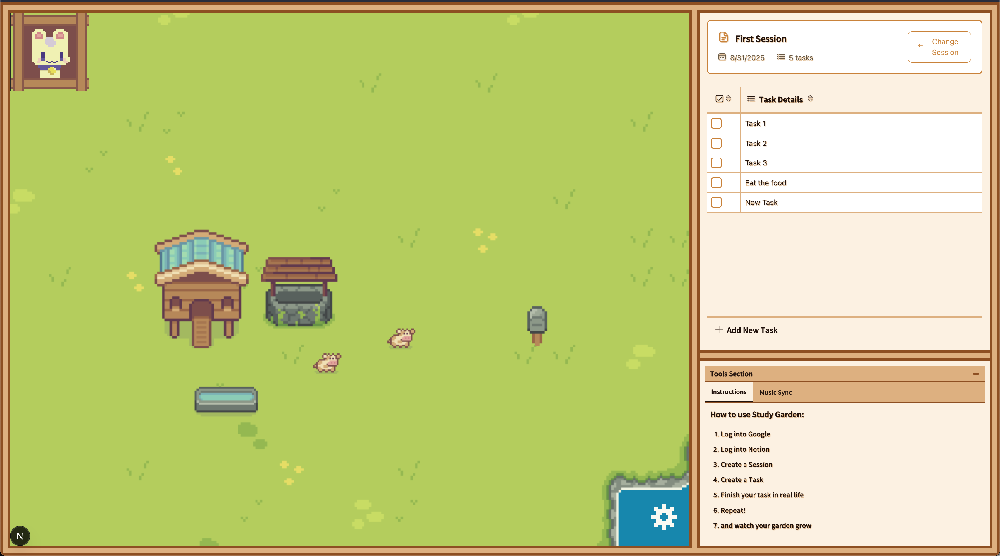

# StudyGarden



## Project Overview

StudyGarden is an engaging idle app designed to gamify productivity. Users grow a virtual garden by completing study tasks, fostering consistent study habits in a rewarding way.

## Features

- **Idle Gameplay:** Encourages consistent focus with rewards.
- **Virtual Garden:** Reflects user progress visually.
- **World Saving & Customization:** Save and load your world layout, and customize your garden with different structures.
- **Task Management:** Organize and prioritize study sessions.
- **Focus Timers:** Stay on track with built-in timers.
- **User Authentication:** Securely track progress across devices.

## Tech Stack

- **Frontend:** Next.js (React), TypeScript, Tailwind CSS, Pixi.js
- **Backend:** Python, FastAPI, PostgreSQL, ArangoDB, Redis
- **Deployment:** Vercel (Frontend), Google Cloud Run (Backend)

## Project Structure

- **Frontend:** Manages UI, user interactions, and local state.
- **Backend:** Handles authentication, data persistence, and business logic.

## Local Development

### Backend

1.  Navigate to the backend directory:
    ```bash
    cd backend
    ```
2.  Install dependencies:
    ```bash
    pip install -r requirements.txt
    ```
3.  Start the development server:
    ```bash
    python run_server.py
    ```
    The backend will be available at `http://localhost:8000`.

### Frontend

1.  Navigate to the frontend directory:
    ```bash
    cd frontend
    ```
2.  Install dependencies:
    ```bash
    npm install
    ```
3.  Start the development server:
    ```bash
    npm run dev
    ```
    The frontend will be available at `http://localhost:3000`.

## Deployment

- **Frontend:** Hosted on Vercel for fast, scalable CI/CD.
- **Backend:** Deployed on Google Cloud Run for serverless scalability.

## Roadmap

- Real-time collaboration features.
- Expanded garden customization options.
- Integration with calendar/task management apps.
- Enhanced analytics and progress reports.
- Mobile app development.
